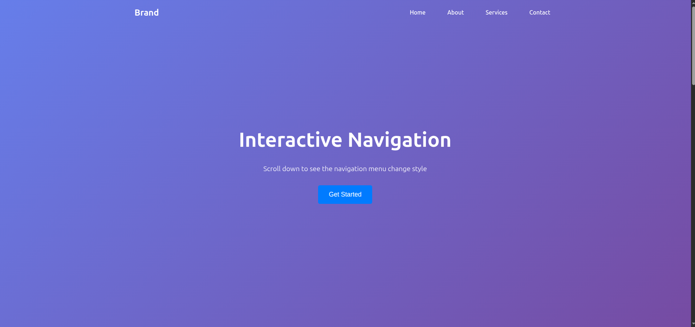

# Internship Task - PRODIGY_WD_01

This project is created as part of my internship at **Prodigy InfoTech** under the **Web Development** domain.

## 📝 Task Overview

This task involves building a basic static webpage using:

- HTML
- CSS
- JavaScript

## 📂 Files Included

- `index.html` – HTML structure
- `style.css` – Styling of the webpage
- `script.js` – JavaScript functionality
- `screenshot.png` – Project preview

## 📸 Screenshot

Below is a screenshot of the webpage:



## 🚀 How to Run

1. Clone this repository:
   ```bash
   git clone https://github.com/lakshitsisodiya/internship_task.git
