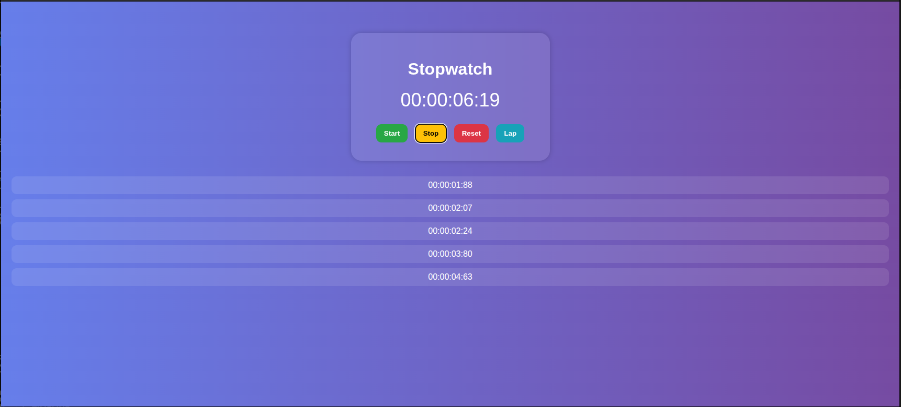

# ⏱ Task 2 - Stopwatch Web App (Internship Project)

This project is part of my internship tasks and involves building a **fully functional stopwatch web application** using **HTML, CSS, and JavaScript**. The stopwatch includes start, stop, reset, and lap features — along with a modern, glassmorphism-inspired UI design.

---
## 📸 Screenshot

Below is a screenshot of the webpage:

## 🚀 Features

- **Start / Stop / Reset** functionality
- **Lap recording** (each click adds a new lap)
- Displays **hours, minutes, seconds, and milliseconds** (2-digit)
- **Live updating** of time using `setInterval()`
- **Glass UI design** using modern CSS (backdrop filter + blur)
- **Simple and clean layout** for beginners to understand easily

---

## 💡 Tech Used

- **HTML5** for structure
- **CSS3** with glassmorphism style (blurred background, gradients)
- **Vanilla JavaScript** for logic and DOM manipulation

---

## 📂 File Structure

