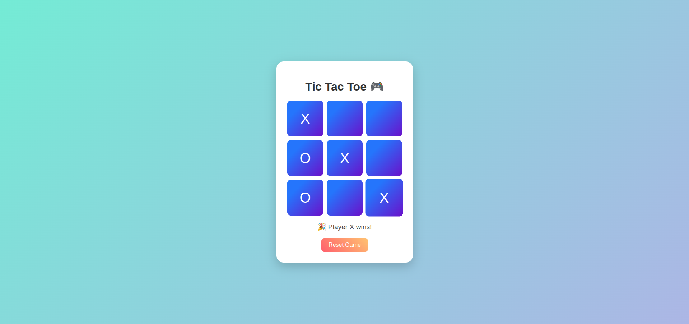

# 🎨 Tic Tac Toe - Colorful Edition

This is a **simple and fun Tic Tac Toe game** built using **HTML, CSS, and JavaScript**. It features a modern colorful UI, animated buttons, and automatically resets the game when someone wins or it's a draw.

---

## 📌 Features

- 🧠 Two-player mode (Player X vs Player O)
- ✅ Auto-clears the board after a win or draw (within 2 seconds)
- 🎨 Beautiful, colorful design with smooth animations
- 🔁 Reset button to start a new game anytime
- 🧱 Easy-to-read and beginner-friendly code

---

## 🛠 Technologies Used

- **HTML5** for the page structure  
- **CSS3** with linear gradients and transitions for styling  
- **JavaScript (Vanilla)** for all the game logic

---

## 🎮 How to Play

1. Open the `index.html` file in any web browser.
2. Players take turns to click on the grid cells.
3. First to make 3 of their symbols in a row (vertical, horizontal, or diagonal) wins!
4. If all cells are filled without a winner, it's a draw.
5. Game automatically resets after a win or draw, or you can manually reset using the **"Reset Game"** button.

---

---

## 📸 Screenshot

---

## 🔄 Future Improvements

- Add score tracking
- Add computer opponent (AI mode)
- Add sound effects
- Store previous game results

---

## 📥 How to Use

1. Download or clone this repo.
2. Open `index.html` in any modern browser.
3. Start playing with a friend!

