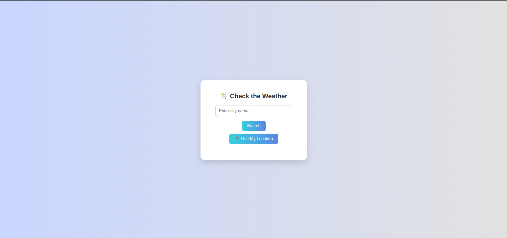

# 🌤️ Weather Checker Web App

A simple and stylish weather app built with **HTML**, **CSS**, and **JavaScript** that lets you fetch real-time weather data by entering a city name or using your current location.

---

## 📌 Features

- 🔍 Get weather by typing the **city name**
- 📍 Use **your current location** (via Geolocation API)
- 🌡️ Displays:
  - Temperature (°C)
  - Weather conditions
  - Humidity
  - Wind speed
- 🎨 Clean, responsive, and beginner-friendly UI

---

## 🛠️ Built With

- HTML5
- CSS3
- JavaScript (Vanilla)
- [OpenWeatherMap API](https://openweathermap.org/api)

---

## 📸 Screenshot

  
> *Add a screenshot of your app and name the file `screenshot.png` in the root folder.*

---

## 🔧 Getting Started

To run this project locally:

### 1. Clone the Repository

```bash
git clone https://github.com/your-username/weather-checker.git
